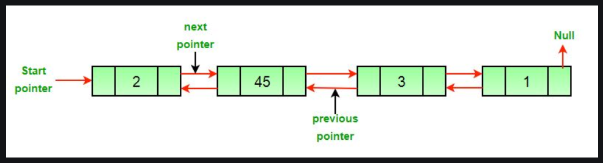
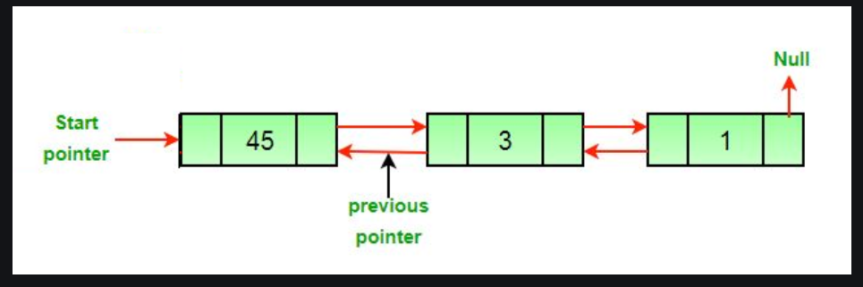
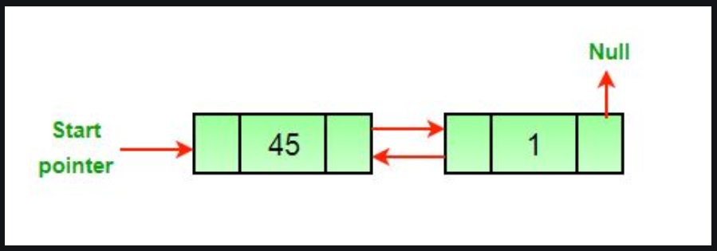
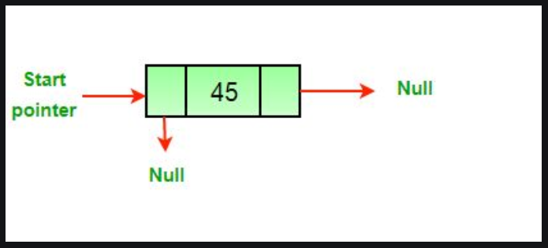

**Example**
```*Input*: DLL = 2->45->3->1, Node=45 \n*Output*: 2->3->1 \n\n **Input**: DLL = 2->45->3->1, Node = 1 \n **Output**: 2->45->3```

**Approach**: The deletion of a node in a doubly-linked list can be divided into 3 categories:
* After the deletion of the head node.

* After the deletion of the middle node.

* After the deletion of the last node.


**All three mentioned cases can be handled in two steps if the pointer of the node to be deleted and the head pointer is known**
1. If the node to be deleted is the head node then make the next node as head.
2. If a node is deleted, connect the next and previous node of the deleted node.


### Algorithm:
* Let the node to be deleted be *del*.
* If node to be deleted is head node, then change the head pointer to next current head.
``` if headnode == del then```
```    headnode = del.nextNode```
* Set prev of next to del, if next to del exists.
```if del.nextNode != none``` 
```  del.nextNode.previousNode = del.previousNode```
* Set next of previous to del, if previous to del exists.
```if del.previousNode != none``` 
```  del.previousNode.nextNode = del.next```

### Complexity Analysis:
* **Time Complexity**: O(1)
    Since traversal of the linked list is not required so the time complexity is constant.
* **Auxiliary Space**: O(1)
    As no extra space is required, so the space complexity is constant

### Advantages of Doubly Linked List over the Singly Linked List:
*   A DLL can be traversed in both forward and backward directions
*   The delte operation in DLL is more efficient if a pointer to the node to be deleted is given
*   We can quickly insert a new node before a given node
*   In a singly linked list, to delete a node, a pointer to the previous node is needed. To get this previous node, sometimes the list is traversed. In DLL, we can get the previous node using the previous pointer

### Disadvantages of DLL over Singly Linked List:
* Every node of DLL requires extra space for a previous pointer. It is possible to implement DLL with a single pointer though.
* All operations require an extra pointer previous to be maintained. For example, in insertion, we need to modify previous pointers together with the next pointers.