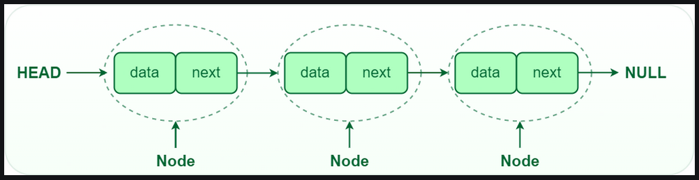
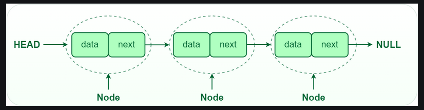
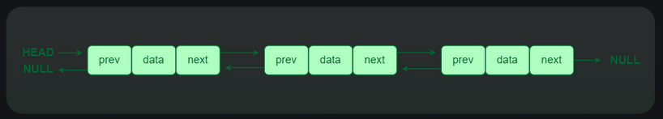
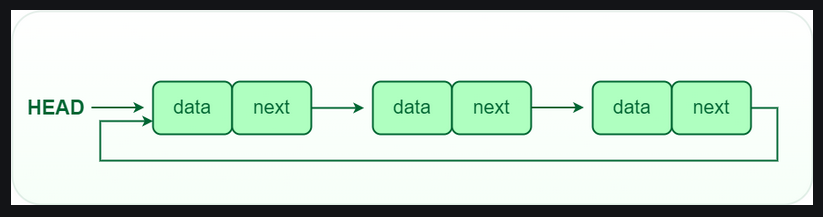

# Linked List

## What is a Linked List?

```A linked list is a linear data structure, in which the elements are not stored in contiguous memory locations. The elements in a linked list are linked using pointers as shown in the below image:```



In simple words, a linked list consists of nodes where each node contains a data field and a reference(link) to the next node in the list.

## Understanding the basics of Linked List

**Node Structure**: A node in a linked list typically consists of two componenets:
1. **Data**: It holds the actual value or data associated with the node.
2. **Next Pointer**: It holds the actual value or data associated with the node.
3. **Head and Tail**: The linked list is accessed through the head node, which points to the first node in the list. The last node in the list points to NULL or nullptr, indicating the end of the list. This node is known as the tail node.

## Why is the Linked List data structure needed?
Here are a few advantages of a linked list that is listed below, it will help you understand why it is necessary to know.

* **Dynamic Data structure**: The size of memory can be allocated or de-allocated at run time based on the operation insertion or deletion.
* **Ease of Insertion/Deletion**: The insertion and deletion of elements are simpler than arrays since no elements need to be shifted after insertion and deletion, just the address needed to be updated.
* **Efficient Memory Utilization**: As we know Linked List is a dynamic data structure the size increases or decreases as per the requirement so this avoids the wastage of memory.
* **Implementation**: Various advanced data structures can be implemented using a linked list like a stack, queue, graph, hash maps, etc.

## Example:

In a system, if we maintain a sorted list of IDs in an array id[] = [1000, 1010, 1050, 2000, 2040]. 

If we want to insert a new ID 1005, then to maintain the sorted order, we have to move all the elements after 1000 (excluding 1000). 

Deletion is also expensive with arrays until unless some special techniques are used. For example, to delete 1010 in id[], everything after 1010 has to be moved due to this so much work is being done which affects the efficiency of the code.

## Types of linked lists:
There are mainly 3 types of linked lists:

1. Single-linked list
2. Doubly linked list
3. Circular linked list

### 1. Single-linked list:

In a singly linked list, each node containes a reference to the next node in the sequence. Tracersing a singly linked list is done in a forward direction.



###  2. Double-linked list:

in a doubly linked list, each node containes references to both the next and previous nodes. This allows for traversal in both forward and backward directions, but it requires additional memory for the backward reference.



### 3. Circular linked list:

In a circular linked list, the last node points back to the head node, creating a circualr structure. It can be either singly or doubly linked.



## Operations on Linked Lists

1. **Insetion**: Adding a new node to a linked list involves adjusting the pointers of the existing nodes to maintain the proper sequence. Insertion can be performed at the beginning, end, or any position within the list
2. **Deletion**: Removing a node from a linked list requires adjusting the pointers of the neighboring nodes to bridge the gap left by the deleted node. Deletion can be performed at the beginning, end, or any position within the list.
3. **Searching**: Searching for a specific vaue in a linked list involves traversing the list from the head node until the value is found or the end of the list is reached.

## Advantages of Linked Lists

* **Dynamic Size**: Linked lists can grow or shrink dynamically, as memory allocation is done at runtime.
* **Insertion and Deletion**: Adding or removing elements from a linked list is efficient, especially for large lists.
* **Flexibility**: Linked lists can be easily reorganized and modified without requiring a contiguous block of memory.

## Disadvantaged of Linked Lists

* **Random Access**: Unlike arrays, linked lists do not allow direct access to elementsby index. Traversal is required to reach a specific node.
* **Extra Memory**: Linked lists require additional memory forstoring the pointers, compared to arrays.

