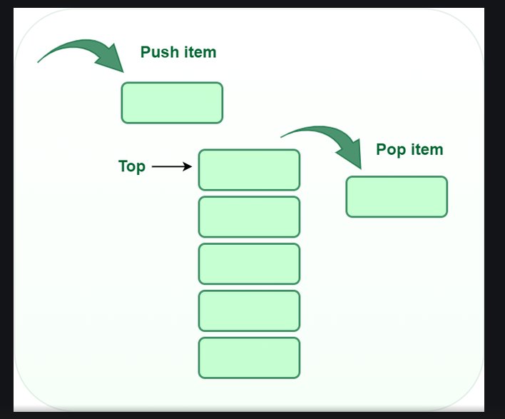

# Stack - The data structure 

## What is a Stack?

``` A stack is a linear data structure in which the insertion of a new element and removal of an existing takes place at the same represented as the top of the stack```

To implement the stack, it is required to maintain the **pointer to the top of the stack**, which is the last element to be inserted because **we can access the elements only on the top of the stack**.

## LIFO (Last In First Out):

```This strategy states that the element that is inserted last will come out first. You can take a pile of plates kept on top of each other as a real-life example. The plate which we put last on the top and since we remove the plate that is at the top, we can say that the plate that put last comes out first.```

## Basic Operations on Stack

In order to make manipulations in a stack, there are certain operations provided to us.

* **push()** to insert an element into the stack
* **pop()** to remove an element from the stack
* **top()** returns the top element of the stack
* **isEmpty()** returns true if stack is empty else false
* **size()** returns the size of stackzz 
  


## Push:
Adds an item to the stack. If the stack is full, then it is said to be an **Overflow Condition**.

### Algorithm for push:

begin
    if stack is full
        return
    endif
    else
        increment top
        stack\[top\] assign value
    end else
end procedure

## Pop:
Removes an item from the stack. The items ar popped in the reversed order in which they are pushed. If the stack is empty, then it is said to be an **Underflow Condition**.

### Algorithm for pop:
begin
    if stack is empty
        return
    endif
    else
        store value of stack\[top\]
        decrement top
        return value
    end else
end procedure

## Top:
Returns the top element of the stack.

### Algorithm for Top:
begin
     return stack\[top\]
end procedure

## isEmpty:
Returns true if the stack is empty, else false.

### Algorithm for isEmpty:
begin
    if top<1
        return true
    else
        return flase
end procedure

## Complexity Analysis:

### Time Complexity:

Operations | Complexity
push() | O(1)
pop() | O(1)
isEmpty() | O(1)
size() | O(1)

## Types of Stacks:
* **Fixed Size Stack**: As the name suggests, a fixed size stack has a fixed size and cannot grow or shrink dynamically. If the stack is full and an attempt is made to add an element to it, an overflow error occurs. If the stack is empty and an attempt is made to remove an element from it, an underflow error occurs.
* **Dynamic Size Stack**: A dynamic size stack can grow or shrink dynamically. When the stack is full, it automatically increases its size to accommodate the new element, and when the stack is empty, it decreases its size. This type of stack is implemented using a linked list, as it allows for easy resizing of the stack.

In addition to these two main types, there are several other variations of Stacks, including:

1. **Infix to Postfix Stack**: This type of stack is used to convert infix expressions to postfix expressions.
2. **Expression Evaluation Stack**: This type of stack is used to evaluate postfix expressions.
3. **Recursion Stack**: This type of stack is used to keep track of function calls in a computer program and to return control to the correct function when a function returns.
4. **Memory Management Stack**: This type of stack is used to store the values of the program counter and the values of the registers in a computer program, allowing the program to return to the previous state when a function returns.
5. **Balanced Parenthesis Stack**: This type of stack is used to check the balance of parentheses in an expression.
6. **Undo-Redo Stack**: This type of stack is used in computer programs to allow users to undo and redo actions.